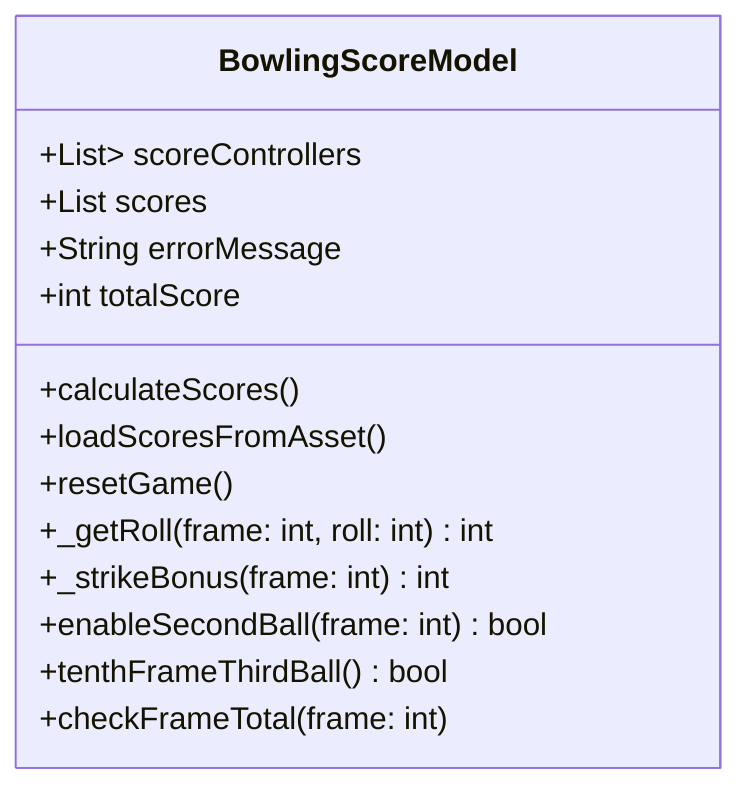

# CS386 Final Project

## Project Introduction

## Design and Architecture

```mermaid
classDiagram
    class BowlingScoreModel {
        +List<List<TextEditingController>> scoreControllers
        +List<int> scores
        +String errorMessage
        +calculateScores()
        +loadScoresFromAsset()
        +resetGame()
        +int totalScore
        +_getRoll(frame: int, roll: int) int
        +_strikeBonus(frame: int) int
        +enableSecondBall(frame: int) bool
        +tenthFrameThirdBall() bool
        +checkFrameTotal(frame: int)
    }
```

## Instructiones

## Challenges, Role of AI, Insights

## Next Steps

