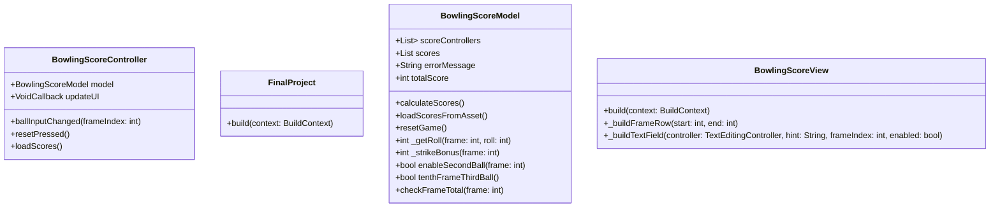

# CS386 Final Project

## Project Introduction
The Bowling Scorecard app is a Flutter-based application designed to help users track their scores during a bowling game. It allows players to input their scores frame by frame, automatically calculates the total score, and handles special cases like strikes and spares. The app also provides a feature to load pre-saved scores from a JSON file. This tool is primarily intended for invested bowlers who want to keep track of their scores on their devices.

## Design and Architecture

The app follows the Model-View-Controller (MVC) design pattern. The Model handles the game's logic, including score calculations and game reset functionality. The View uses a widget system and provides an interactive user interface for score input. The Controller acts as the intermediary between the Model and View, updating the UI whenever changes are made to the game state.

Here is the class diagram for the project:

## Instructiones

#### Installation:
Before installing, make sure Flutter SDK, Dart SDK, and Visual Studio Code are installed.
To install, run the following in a terminal:
- git clone https://github.com/LelandJones/project.git
- cd bowlingapp

#### Running the App:

To launch the app, run the following commands in the terminal: 
- flutter pub get
- flutter run

#### Using the App:

The app allows you to input scores for each frame. You can reset the game at any time by pressing the reset button.
Scores are automatically calculated and displayed after every input.
You can also load pre-saved scores from an asset file using the "Load Scores from Assets" button.

#### Testing:

The app can be tested manually by inputting scores and confirming that the total score updates correctly.
You can also test loading and saving scores by interacting with the "Load Scores from Assets" and "Reset" buttons.

## Challenges, Role of AI, Insights

The main challenge was ensuring that the game’s scoring logic correctly handled all special cases, including strikes, spares, and the 10th frame without errors. I had to make the 10th frame handle the strike and spare logic differently, as a potential extra ball could be inputted if achieved successfully. The Flutter language challenged me, as the main coding language I had seen before was Python. I didn't have exposure to Java or C++, so learning the whole system of brackets brought some challenges for me.

I used AI to help with the work that required nitpicking, such as making sure logic lined up correctly, and I also asked for methods and ways I could achieve the logic I wanted to implement. I used it as a guide and not a dependency. It was a tool that I could use when I got stuck.

## Next Steps

If I had more time, I would like to add the following features:
- Allow the app to save multiple games over time.
- Add visual icons for strikes and spares to make it more visually appealing.
- Implement a leaderboard to store and display the highest scores across multiple users.

